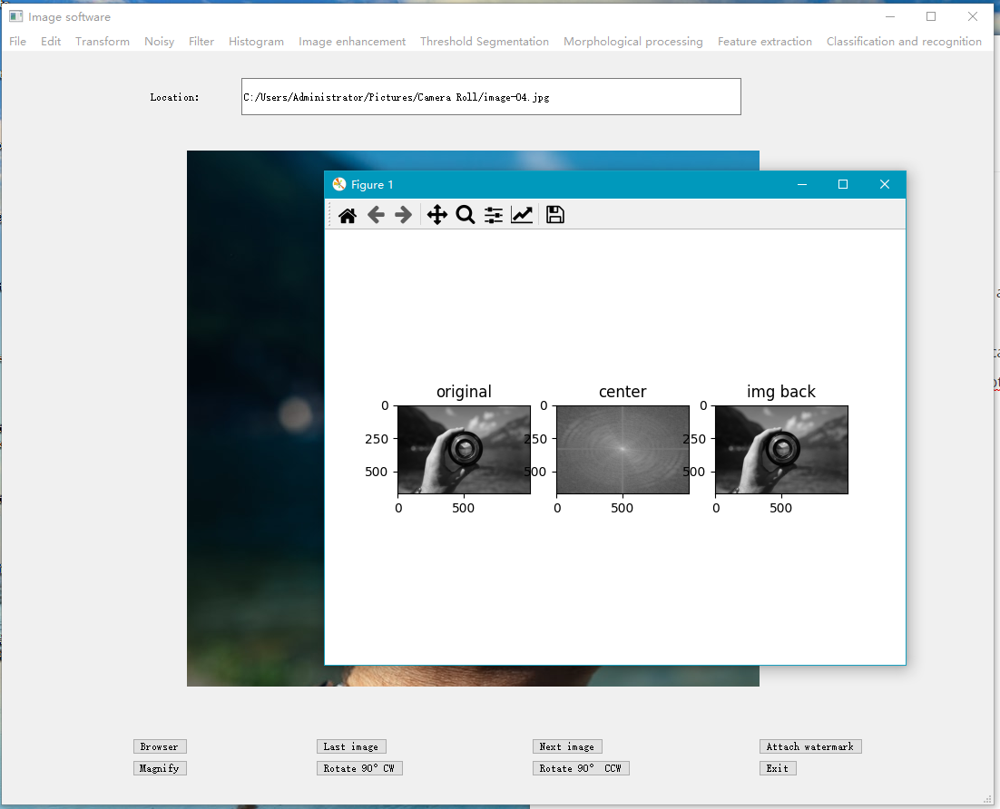

# CV_interface

1. Introduction

   A imaging software made by pyQt5.

2. Design

   2.1 Design user interface with Qt5. Put buttons and menus on the interface.

   2.2 Add event to the menus and buttons.

   2.3 Write the function for menus and buttons, call back the function through triggers.

   2.4 Show the processed image with the "matplotlib" library.

3. The interface is below:

   

   

4. Issue and development

   4.1 Client can not input the parameters

   4.2 Multi-threading programming for multiple-file processing.
